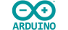

# Introduction
---

The BrainPad is the only educational product which provides a continuous path from beginner programmer to professional programmer.  You can start by learning drag and drop programming using Microsoft MakeCode and work your way up to the exact same tools used by professional programmers.  Some of the more advanced options are listed below.

## C# (C Sharp) 

C# is a close cousin the C and C++ and Java which are among the most popular programming languages used by professionals.  A general-purpose object-oriented programming language, C# can be used not only to program the BrainPad, but also desktop computers and mobile devices.  We use Visual Studio to program in C#, which means not only to you get a world class development environment which is used by the pros, but it's also free!

## Visual Basic 

Microsoft Visual Basic is very similar in capabilities to C#.  It is a little easier to use than C# (especially for beginners) but is not as widely used.  While Visual Basic is a great way to learn programming, C# is more relevant to the world of professional programming.  Like C#, we us Visual Studio for Visual Basic programming, so you can get a popular, professional, top quality programming environment for free!

## Arduino 
If you are familiar with the Arduino programming environment you can use it to program the BrainPad in C++.    We encourage students to learn Visual Studio as it is more widely used professionally, but Arduino has become a very common and widely accepted standard among students, hobbyists, and engineers.

[Click here to get started with Arduino on the BrainPad](arduino.md).

## MicroPython 
You can also program the BrainPad in MicroPython.  The BrainPad is a great platform for those who know or wish to learn the Python programming language.  The Python computer language emphasizes code readability and allows programmers to write programs using fewer lines of code than most other common computer languages.

[Click here to get started in MicroPython on the BrainPad](micropython.md).

## Mbed 
Mbed is a free online development environment that can be used to program the BrainPad in C or C++ without downloading or installing anything.  Mbed is not as friendly a development environment as VisualStudio -- you don't get the TinyCLR operating system or the advanced features and debugging of Visual Studio.  The advantage of Mbed is that the entire system is completely web based.  There is no software to install, maintain or update on your computer, and it is always available on any computer anywhere in the world.

[Click here to get started using Mbed with the BrainPad](mbed.md)

## Plain C/C++
You can also write programs from scratch using one of the more traditional C/C++ development tools.  Many of these tools are available for free.  

[Click here to get started using traditional compilers with the BrainPad](plain-coding.md)