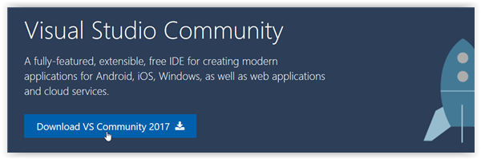
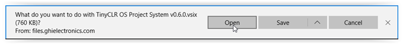

# Using Visual Studio with the BrainPad
---
We recommend trying Microsoft Visual Studio when you're ready to move beyond MakeCode.  Visual Studio is the most popular desktop program development environment and is used by professional programmers the world over. The experience you gain programming the BrainPad in Visual Studio also applies to programming desktop computers and smart phones, and Visual Studio's advanced debugging and code completion features make writing code a breeze!

### Step 1: Install Visual Studio on your computer.

Skip this step if you already have Visual Studio installed on your computer.

The Visual Studio Community Edition is free and can be found here: [Microsoft Visual Studio 2017 Community Edition.](https://www.visualstudio.com/vs/community/)

Click on the above link an then click on the `Download VS Community 2017` button. After downloading is complete, run the file. If you are asked, allow the program to make changes to your device.

When the installation program shows the "Workloads" screen, select `.NET desktop development` (you should see a check mark in the `.NET desktop development` box) and then click the `Install` button.

After installation is complete, click on the `Launch` button. You will be asked to sign in or sign up for Visual Studio developer services. You can either sign in (or sign up) now or click the "Not now, maybe later" option. You will then be asked to pick a color scheme and Visual Studio will start.

### Step 2: Install the TinyCLR extension.

If you don't have the TinyCLR extension installed on your computer install it now.

If Visual Studio is open, close it before continuing with the TinyCLR installation.

The link to the GHI Electronics download page is here: [GHI Electronics Download Page](http://docs.ghielectronics.com/tinyclr/downloads.html#visual-studio-project-system)

Click on the above link and under "Visual Studio Project System" click on the latest release in the top row of the table (v0.6.0 when this document was written). When asked, open the file. If you are asked, allow the program to make changes to your device.

In the "VSIX Installer" dialog box click the `Install` button.

### Step 3: Start Visual Studio and Check for TinyCLR.

Start Visual Studio. Click on the `File` menu, then click on `New` and then `Project`. The "New Project" dialog box will open.

The small triangle to the left of each heading in the left column of the dialog box will expand (or show) the options underneath it. Under the "Installed" heading you should find the "Visual C#" and "Visual Basic" programming languages listed. Under each of these languages you should see the "TinyCLR" option.

Congratulations! You have successfully installed Visual Studio and the TinyCLR extension. You can now start programming the BrainPad by picking a language (Visual C# or Visual Basic) and clicking on the link below.

We recommend that students with no programming experience start with C# (C sharp). C# is more like C and C++, which are the most widely used programming languages and are the foundation of many university computer science programs.

However, if you have previous BASIC programming experience you may want to start with Visual Basic. Visual Basic can be a little easier to work with and is also a very powerful and capable programming language. Starting with C#, however, may make it easier to learn C or C++ later.

Click on a link below to get started:

[Getting Started on the BrainPad using Visual C#](csharp/csharp.md) (Used by more professional programmers)

[Getting Started on the BrainPad using Visual Basic](vb/visual-basic.md) (Easier for beginners)
