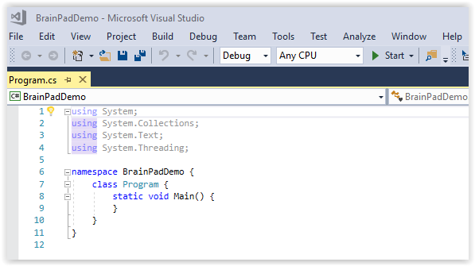

# Introduction to C# (C sharp)
---
It is not a secret that C and C++ are the most popular programming languages among professionals. This is particularly true for programmers that work with small digital systems.

C# is the modern cousin of the C and C++ family. Its syntax is very close to JAVA, another very popular programming language.

## Before you start
You should have already installed Visual Studio on your computer as well as the TinyCLR extension.  If not, please start with [System Setup](../system-setup.md) for instructions on how to do so.

Also, you need a BrainPad and a micro USB cable to continue.  Plug the BrainPad into the USB port of your computer.  The red power light on the BrainPad should be on.

## Hello World
The first step is to write some very simple code to see if your BrainPad will respond when we try to program it.  This is usually called a "hello world" program.

### Start a New Project

Open Visual Studio.  In the `File` menu select `New` and then `Project` to open the "New Project" dialog box.


In the left panel of the  "New Project" window you can click on the small triangles to the left of each heading to expand the heading and show the options beneath it.

You should see the "Visual C#" language listed under the "Installed" heading in the left panel of the "New Project" window.

Under "Visual C#" select the "TinyCLR" option.

In the center panel of the "New Project" window select "BrainPad Application".

At the bottom of the "New Project" window you can change the name and location of your application or just stick with the default.  When starting out you may wish to click on the `Browse` button and select the folder "Desktop" (in the left panel) to make your application easier to find.

Click the `OK` button on the bottom right of the "New Project" window.  This will create a new blank project.


Once created, you'll be presented with a `Program.cs` tab.



### Add the Code

In the `Program.cs` tab we will enter short sample program (our "Hello World" code). Cut and paste the following code into the `Program.cs` window.
```
Code goes here
```

### Deploy the Program

Let's run the program now to see the code come to life. If your BrainPad is not connected to your computer with a micro USB cable connect it now. Press the `F5` function key or the `Start` button (shown below) to copy the program from your computer to your BrainPad.


Visual Studio will now tell your BrainPad to run the code.  A few things will happen and the display will now show the text "Hello!" and the light bulb (or LED) will blink.

What happened exactly? Our application began by running the `BrainPad.Display.DrawTextAndShowOnScreen(0, 0, "Hello!")` line to instruct the display to show the text "Hello!"

The line `BrainPad.Display.DrawTextAndShowOnScreen(0, 0, "Hello!")` is known as a function call.  The name of the function is "DrawTextAndShowOnScreen()."  This function is part of the "Display" object, which is part of the "BrainPad" object.

The items listed in parenthesis (0, 0, "Hello!") are called the arguments of the function.  In this case the first zero tells the BrainPad to display the text at the left side of the BrainPad display.  If this number is increased the text will appear further to the right of the screen.  The second zero tells the BrainPad to print the text at the top of the display.  If this number is increased the text will be printed lower on the screen.  The third arugument, "Hello!," tells the BrainPad what text to display on the screen.

After `BrainPadSetup()` is finished, the `While` loop starts running. Code placed inside this while loop is executed in an infinite loop. This is why the code that turns the LED on and then off never stops.
