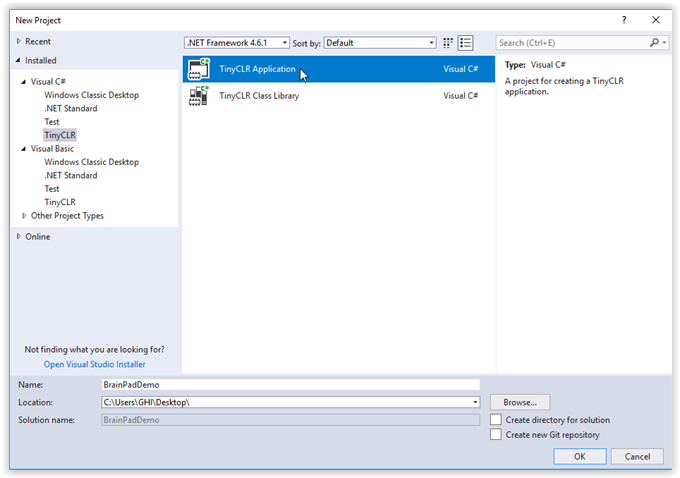
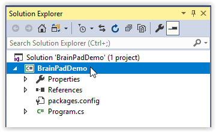
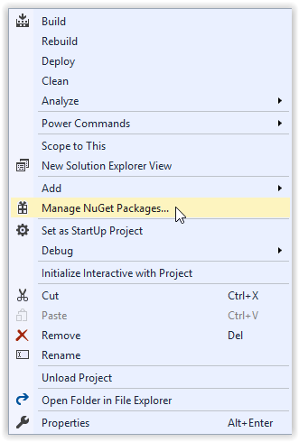
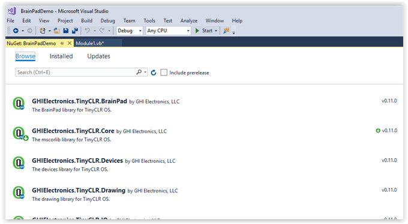
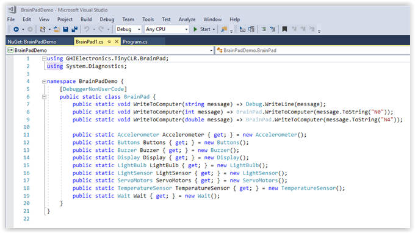
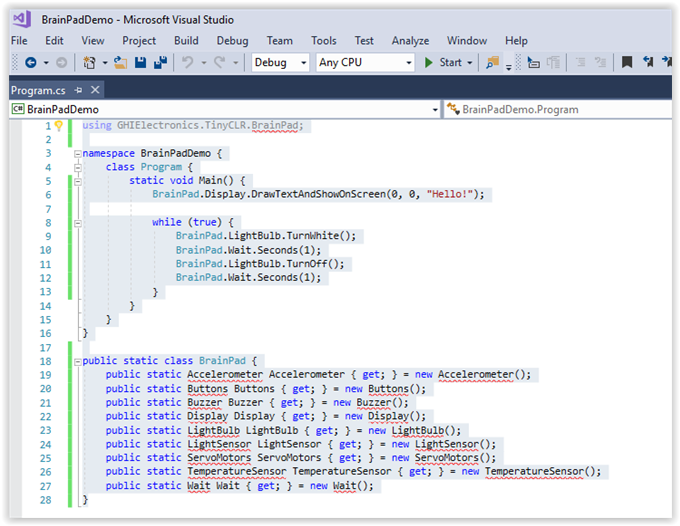
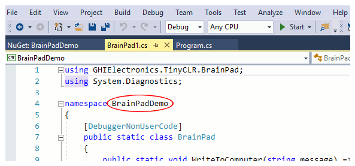

# Introduction to C# (C sharp)
---
It is not a secret that C and C++ are the most popular programming languages among professionals. This is particularly true for programmers that work with small digital systems.

C# is the modern cousin of the C and C++ family. Its syntax is very close to JAVA, another very popular programming language.

## C# Introduction Overview
The instructions on this page describe how to run your first C# program (a "hello world" program) on the BrainPad. The steps are as follows:

  * [Start a new project](#start-a-new-project).
  * [Manage the NuGet packages](#manage-the-nuget-packages).
  * [Add the BrainPad helper code](#add-the-brainpad-helper-code).
  * [Add the sample program](#add-the-sample-program).
  * [Deploy the program](#deploy-the-program)

## Before you start
You should have already installed Visual Studio on your computer as well as the TinyCLR extension. If not, please start with [System Setup](../system-setup.md) for instructions on how to do so.

Also, you need a BrainPad and a micro USB cable to continue. Plug the BrainPad into the USB port of your computer. The red power (PWR) light on the BrainPad should be on.

## Hello World
The first step is to write some very simple code to see if your BrainPad will respond when we try to program it. This is usually called a "hello world" program.

### Start a New Project

Open Visual Studio.  In the `File` menu select `New` and then `Project` to open the `New Project` dialog box.


In the left panel of the `New Project` window (see below) you can click on the small triangles to the left of each heading to expand the heading and show the options beneath it.

You should see the `Visual C#` language listed under the `Installed` heading in the left panel of the `New Project` window.

Under `Visual C#` select the `TinyCLR` option.

In the center panel of the `New Project` window select `TinyCLR Application`.

At the bottom of the `New Project` window you can change the name and location of your application. Change the name to "BrainPadDemo." You may wish to click on the `Browse` button and select the folder `Desktop` (in the left panel) to make your application easier to find.

Click the `OK` button on the bottom right of the `New Project` window.  This will create a new blank project.



Once created, you'll be presented with a `Program.cs` tab.


### Manage the NuGet Packages
C# source files are listed in the `Solution Explorer` window. If the `Solution Explorer` window is not visible, click on `View > Solution Explorer` to open it.



The squiggly red lines under items in the `Solution Explorer` window indicate errors. In this case the errors are caused by missing Nuget packages. Let's tell Visual Studio to include the Nuget packages and fix that now.

If you right click on the project name in the Solution Explorer window a drop down menu will appear. Select `Manage NuGet Packages...` from the menu.

 

Now you should see the installed TinyCLR NuGet library (GHIElectronics.TinyCLR.Core). We need to install a couple more libraries for our program to run.


Click on `Browse`. You should see a list of available Nuget packages in your local feed.



Click on the `GHIElectronics.TinyCLR.BrainPad` package and then click on the `Install` button.


Installing the BrainPad Nuget package will automatically install the `GHIElectronics.TinyCLR.Devices` and `GHIElectronics.TinyCLR.Pins` packages as well. Click on `OK`.


Now accept the license agreement to install the packages.


Close the `NuGet...` tab to get back to your `Program.cs` window. The red squiggles should now be gone.

### Add the BrainPad Helper Code

The BrainPad Helper code provides needed definitions for some BrainPad objects. To add this file to your program, select `Add New Item...` in the `Project` menu. Then in the `Add New Item` dialog box click on `BrainPad Helper` and then click on the `Add` button. You will see a tab labeled `BrainPad1.cs` with contents as shown below.



### Add the Sample Program

In the `Program.cs` tab we will enter short sample program (our "Hello World" code). Cut and paste the following code into the `Program.cs` window.
```
using GHIElectronics.TinyCLR.BrainPad;

namespace BrainPadDemo {
    class Program {
        static void Main() {
            BrainPad.Display.DrawText(0, 0, "Hello!");
            BrainPad.Display.RefreshScreen();

            while (true) {
                BrainPad.LightBulb.TurnWhite();
                BrainPad.Wait.Seconds(1);
                BrainPad.LightBulb.TurnOff();
                BrainPad.Wait.Seconds(1);
            }
        }
    }
}
```

Your `Program.cs` window should look like this:


#### A few words about namespaces

When you create a new C# project, a default namespace is automatically created for you. If you cut and paste code into your project you have to keep the original namespace for the project to work. You can view the project's namespace in the BrainPad Helper file as shown below.

**Namespace shown in BrainPad helper file:**


**Namespace shown in program file. This must match the namespace in the BrainPad Helper file:**


If you did not name your project "BrainPadDemo" when you created it, you will have a namespace mismatch when you paste the above sample program into your project. Just change the namespace in the `Program.cs` window to match the namespace in the BrainPad Helper file and you should be good to go.

Another option is to add a `using` statement at the top of the program file that references the namespace in the BrainPad helper file. If you created a project named "BrainPadDemo" and paste in code with a different namespace, you can add the line `using BrainPadDemo;` at the top of the pasted code to fix the namespace mismatch. The name following `using` must match the namespace in the BrainPad Helper file.

### Deploy the Program
Make sure your BrainPad is plugged into the computer's USB port. Now hit the start button as shown in the above image (or hit the `F5` key). If you've done everything correctly the program will compile and deploy to your device. The message "Hello World!" should appear on the BrainPad display, and the light bulb should start blinking.

Congratulations! You're on your way to learning advanced programming on the BrainPad!

What happened exactly? Our application began by running the `BrainPad.Display.DrawText(0, 0, "Hello!")` and `BrainPad.Display.RefreshScreen()` lines to instruct the display to show the text "Hello!"

The line `BrainPad.Display.DrawText(0, 0, "Hello!")` is known as a function call. The name of the function is "DrawText()." This function is part of the "Display" object, which is part of the "BrainPad" object.

The items listed in parenthesis (0, 0, "Hello!") are called the arguments of the function. In this case the first zero tells the BrainPad to display the text at the left side of the BrainPad display. If this number is increased the text will appear farther to the right on the screen. The second zero tells the BrainPad to print the text at the top of the display. If this number is increased the text will be printed lower on the screen. The third arugument, "Hello!," tells the BrainPad what text to display on the screen.

After the display lines are finished, the `While True` loop starts running. Code placed inside this while loop is executed in an infinite loop. This is why the LED keeps blinking and never stops.