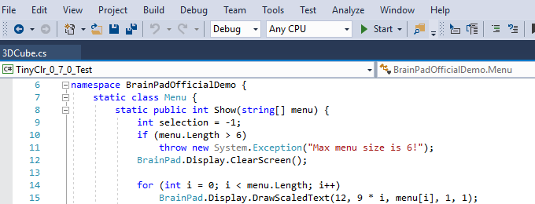

# Go Beyond
---

**Mobile Friendly Menu**

* [**Introduction**](intro.md)
* [System Setup](system-setup.md)
* [Visual Basic](vb/intro.md)
* [C#](csharp/intro.md)
* [Projects](projects/intro.md)
* [Other Software](other-software/intro.md)

---

The BrainPad gives you the option to code in a truly professional development environment: Microsoft Visual Studio. Visual Studio provides modern event driven programming with full debugging allowing you to easily manage projects of any size. You will learn the same real-world programming skills used by professionals. Don't worry -- we go step by step allowing you to learn at your own pace while advancing as far as you like. 

> [!Tip]
> An easier path to [**Start Making**](../start-making/intro.md) with the BrainPad is through MakeCode, an online tool with nothing to install. It's your choice depending on your goals and skill level.

Visual Studio needs to be installed on your computer. If you haven't done so, start now with [System Setup](system-setup.md)

---
You are on the documentation website for the BrainPad. The main website is found at [www.brainpad.com](http://www.brainpad.com/)
