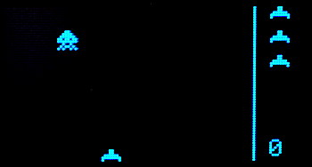

# Projects
---
These are a collection of C# projects ranging from easy to advanced. If you want to use VB, then refer to [C# to VB](../vb/csharp-to-vb.md) page.

> [!Tip]
> Also see the simpler [MakeCode Projects](../../start-making/projects.md)

# Space Invasion

A retro style game.

---
You are on the documentation website for the BrainPad. The main website is found at [www.brainpad.com](http://www.brainpad.com/)
