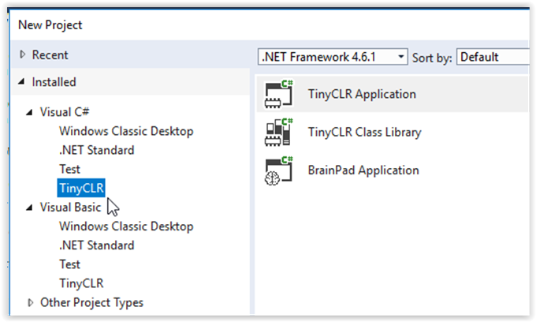

# System Setup
---

TinyCLR OS is the tiny operating system that lets the BrainPad work with .NET and Microsoft Visual Studio, both in C# and in Visual Basic. This professional development setup requires some system preparation before we can start having fun!
> [!Tip]
> You can learn more about TinyCLR OS on the [GHI Electronics website](https://www.ghielectronics.com/tinyclr/features)

## Step 1: Install the Necessary Software
---
### Visual Studio
The Visual Studio Community Edition is free and can be found here: [Microsoft Visual Studio 2017 Community Edition.](https://www.visualstudio.com/vs/community/)

[](https://www.visualstudio.com/vs/community/)

Click on the above link an then click on the **Download VS Community 2017** button. After downloading is complete, run the file. If you are asked, allow the program to make changes to your device.

When the installation program shows the `Workloads` screen, select `.NET desktop development` (you should see a check mark in the `.NET desktop development` box) and then click the `Install` button.


After installation is complete, click on the `Launch` button. You will be asked to sign in or sign up for Visual Studio developer services. You can either sign in (or sign up) now or click the 'Not now, maybe later' option. You will then be asked to pick a color scheme and Visual Studio will start.

### TinyCLR OS Project System.

If Visual Studio is open, close it before continuing with the TinyCLR installation.

Download the [TinyCLR Visual Studio Project System 0.10.0](http://files.ghielectronics.com/downloads/TinyCLR/Extensions/TinyCLR%20OS%20Project%20System%20v0.10.0.vsix). After the download is complete, click on the up arrow next to the download name at the bottom of the screen as shown below.


Then select `Open` from the pop-up menu.


In the `VSIX Installer` dialog box click the `Install` button.


## Step 2: Prepare the BrainPad
---

> [!Tip]
> If you have the original BrainPad Concept/Prototype the setup is slightly different. See the [**Older BrainPad**](..\resources\older-brainpad.md) page for more details.

To prepare the BrainPad you only need to install the latest firmware as shown below.

1. Download and save the TinyCLR OS v0.10 firmware from [Downloads](../resources/downloads.md). We recommend saving the firmware file on your desktop.
2. Connect the BrainPad to your computer using a micro USB cable. The PWR light on the BrainPad should be on.
3. Press and hold the RESET button on the BrainPad for at least three seconds until the Light Bulb on the BrainPad lights up green.
4. A window will open named `BrainPad2`. Drag the firmware file from step 1 into this window.
5. The Light Bulb on the BrainPad will flicker and a progress gauge will appear on the computer screen.
6. It only takes a few seconds for the firmware to be copied to the BrainPad. When it is done, the green light on the BrainPad will stop flickering and the `BrainPad2` window will close.
7. Congratulations! Your BrainPad is now running the latest firmware!


> [!Note]
> The BrainPad comes with a "bootloader" pre-installed. You shouldn't have to reinstall it unless you are an advanced user using advanced programming techniques. Check out our [**bootloader**](../resources/bootloader.md) page to find out more.


## Step 3: Test Application
---

Start Visual Studio. Click on the `File` menu, then click on `New` and then `Project`. The `New Project` dialog box will open.


The small triangle to the left of each heading in the left column of the dialog box will expand (or show) the options underneath it. Under the `Installed` heading you should find the `Visual C#` and `Visual Basic` programming languages listed. Under each of these languages you should see the `TinyCLR` option.



From under `Visual C#` select `TinyCLR` and then Select `TinyCLR Application`. Give your project a name and a location. We will name it `BrainPadTest` and place it on the Desktop. Visual Studio will now generate a project that you can deploy to the BrainPad.

Connect the BrainPad to the PC and click `Start` or press the `F5` key. Visual Studio will now compile the project and deploy the application to the BrainPad through the USB cable.

(image)

If you have any problems go back and make sure you followed all the steps listed above.  If you're still having problems go to the [Troubleshooting Guide](../resources/troubleshooting-guide.md).

---
## Going Beyond!
Congatulations! You are now ready to start developing like a professional. You have the option of using the [C#](csharp/intro.md) programming language or the [Visual Basic](vb/intro.md) programming language. If you are not sure which one to pick, C# is used more often in the professional world and is recommended for those serious about learning programming. Visual Basic is easier to use -- especially for beginners. We use C# for our own software development, but we usually start with Visual Basic for those who are new to programming.

You are not locked in to one language -- you can freely switch between C# and Visual Basic.

To give you a better idea, here is code that counts from 1 to 10 on the BrainPad display in C#:

```
namespace Counter {
    class Program {
        public void Main() {
            for (int count = 1; count < 11; count++) {
                BrainPad.Display.DrawNumberAndShowOnScreen(0, 0, count);
                BrainPad.Wait.Seconds(1);
            }
        }
    }
}
```

And here is equivalent code in Visual Basic:
```
Class Program
    Public Sub Main()
        For count = 1 To 10
            BrainPad.Display.DrawNumberAndShowOnScreen(0, 0, count)
            BrainPad.Wait.Seconds(1)
        Next count
    End Sub
End Class
```

Click on a link below to get started:

* [C# Introducton](csharp/intro.md)
* [Visual Basic Introduction](vb/intro.md)


---
You are on the documentation website for the BrainPad. The main website is found at [www.brainpad.com](http://www.brainpad.com/)
