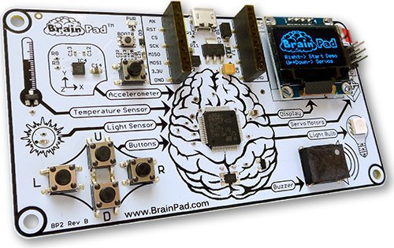
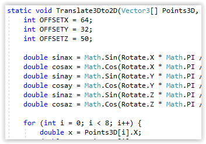

# The BrainPad Documentation
---

The BrainPad is an exciting STEM mini computer for learning and coding video games, robots and electronics.

For a quick getting started, the **Beginners' Guide ebook is available in mutiple languages** [here](http://brainpad.com/start). This documentation website adds a lot more details.

<iframe width="560" height="315" src="https://www.youtube.com/embed/wMGXnSN2Xvk" frameborder="0" allowfullscreen></iframe>

## STEM is a path, not a toy.

**From beginner to expert, the BrainPad evolves to expand your abilities. BrainPad: For every age\*, for every skill level -- for everyone!**

\*Adult supervision required for ages 12 and under.

<iframe width="560" height="315" src="https://www.youtube.com/embed/8v1uMic-fog" frameborder="0" allowfullscreen></iframe>

### There are two main paths to get started with the BrainPad:

|  | [Start Making](start-making/intro.md) | [Go Beyond](go-beyond/intro.md) |
|--|--|--|
|  |  |  |
| **Platform** | Based on Microsoft MakeCode | Based on .NET and Visual Studio |
| **Language** | Drag and drop blocks and Javascript | C# and Visual Basic |
| **Setup** | Online tools with nothing to install | Requires system setup |
| **Setup Time** | Instant | About an hour |
| **Skill Level** | Beginner.  Easy to start with and learn | Beginner through professional |
| **Requirements** | Any operating system with any modern web browser | Windows (version 7 or newer) computers only |
| **Troubleshooting** | Limited | Full featured debugging tools |
| **Ages** | 6+ | 12+ |
| | [Start Making Now](start-making/intro.md) | [Go Beyond Now](go-beyond/intro.md) |

---
You are on the documentation website for the BrainPad. The main website is found at [www.brainpad.com](http://www.brainpad.com/)
