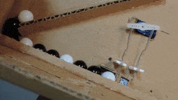

# Projects
---

This is a collection of BrainPad projects ranging from easy to advanced. If you want to use Visual Basic, please refer to the [C# to Visual Basic](../go-beyond/vb/csharp-to-vb.md) page.

> [!Tip]
> Also see the simpler Microsoft MakeCode [**Projects**](../start-making/projects.md)

|  |  |
|--|--|
| [**Space Invasion**](space-invasion.md)  |  [**Pong**](pong.md)  |
|  |  |
| [**Space Force Robot**](space-force.md) (*additional hardware required*) | [**Snap Circuits Lift-Off**](lift-off.md) (*additional hardware required*) |
|  |  |
| [**Marble Sorting Robot**](marble-sorter.md) (*additional hardware required*) | [**Sun Seeking Robot**](sun-seeker.md) (*additional hardware required*) |
|  |  |
| [**Burgler Alarm**](burglar-alarm.md) | [**Tilt Etch A Sketch**](tilt-etch-a-sketch.md) |
|  |  |
| [**Etch A Sketch**](etch-a-sketch.md) | [**High/Low Thermometer**](high-low-thermometer.md) |
|  |  |
| [**Stepper Motors**](stepper-motors.md) (*additional hardware required*) | [**Linear Clock**](linear-clock.md) (*additional hardware required*) |
|  |  |
| [**Electronic Dice**](electronic-dice.md) | [**3D Cube**](3d-cube.md) |
|  |  |
| [**Color Mixer**](color-mixer.md) |  |
|  |  |

---
You are on the documentation website for the BrainPad. The main website is found at [www.brainpad.com](http://www.brainpad.com/)
