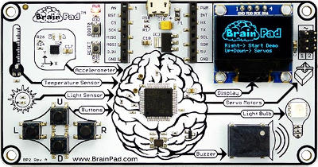

# Older BrainPads
---
Some early adopters have original concept and prototype BrainPads. We appreciate your support and want to thank you for helping make the BrainPad the best path for STEM education.

We highly recommend switching to the production BrainPad. If you are still using an older BrainPad this page will explain the differences.

## Pre-production BrainPad

This version is identical to the production BrainPad except for a different reset circuit. The pre-production BrainPad as a smaller reset button.

Pressing and holding the reset button on the production BrainPad will put it in loader mode. To do the same on the pre-production board (with the smaller reset button), press and hold the left button, press and release the reset button, wait a second, and release the left button. 

In other words, whenever you are instructed to press and hold reset for three seconds, you will follow the instructions above instead. In all other respects this BrainPad is the same as the production BrainPad.

## Concept BrainPad

This BrainPad was much larger. You can identify it by the Traffic Light in the top right Corner. This version uses the G30 chipset.

Unfortunately, this version only works with TinyCLR OS. It does not work with MakeCode or any other software. We try to keep the the latest TinyCLR OS BrainPad libraries compatible and workable with this board but we recommend switching to the production BrainPad.

To use with TinyCLR OS, follow the instructions on the GHI Electronics [G30 support page](http://docs.ghielectronics.com/hardware/scm/g30.html). From there you can use all C# and VB examples as is or with minor changes.

## Other Concepts and Prototypes
There were some other concept and prototype BrainPads as well. Those BrainPads are very rare and will no longer be supported.

---
You are on the documentation website for the BrainPad. The main website is found at [www.brainpad.com](http://www.brainpad.com/)
